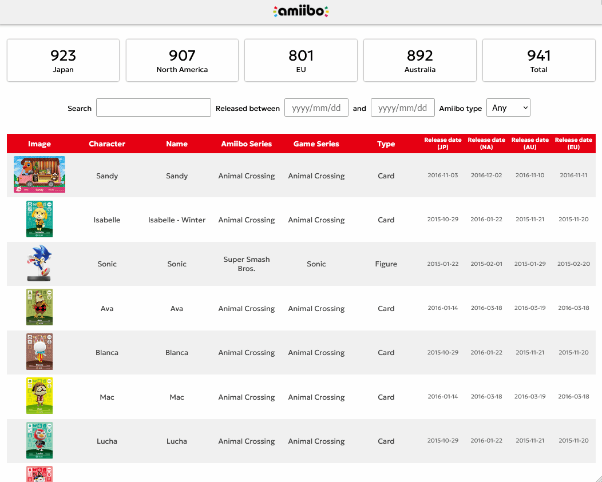

# Web Development Project 5 - *Amiibo database*

Submitted by: **Tatiana Vela**

This web app: **a searchable database of Amiibo releases**

Time spent: **11** hours spent in total

## Required Features

The following **required** functionality is completed:

- [x] **The site has a dashboard displaying a list of data fetched using an API call**
  - The dashboard should display at least 10 unique items, one per row
  - The dashboard includes at least two features in each row
- [x] **`useEffect` React hook and `async`/`await` are used**
- [x] **The app dashboard includes at least three summary statistics about the data** 
  - The app dashboard includes at least three summary statistics about the data: in Japan, North America, EU, Australia, and total releases

- [x] **A search bar allows the user to search for an item in the fetched data**
  - The search bar **correctly** filters items in the list, only displaying items matching the search query
  - The list of results dynamically updates as the user types into the search bar
- [x] **An additional filter allows the user to restrict displayed items by specified categories**
  - The filter restricts items in the list using a **different attribute** than the search bar 
  - The filter **correctly** filters items in the list, only displaying items matching the filter attribute in the dashboard
  - The dashboard list dynamically updates as the user adjusts the filter

The following **optional** features are implemented:

- [x] Multiple filters can be applied simultaneously
- [x] Filters use different input types
  - e.g., as a text input, a dropdown or radio selection, and/or a slider
- [x] The user can enter specific bounds for filter values

## Video Walkthrough

Here's a walkthrough of implemented features:

<!-- Replace this with whatever GIF tool you used! -->
GIF created with [ScreenToGif](https://www.screentogif.com/) for Windows

## Notes

Describe any challenges encountered while building the app.
